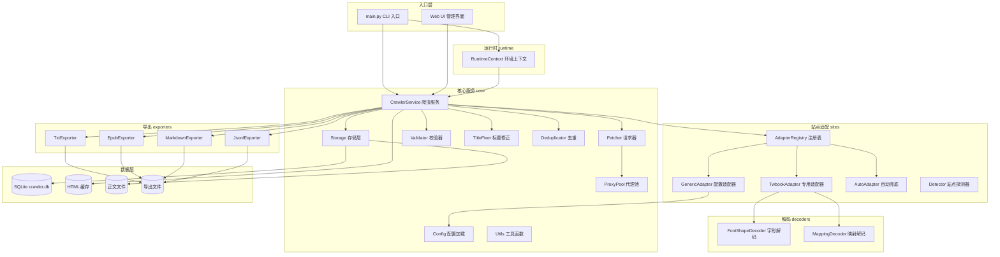

# 系统架构文档

Novel Crawler 是一个跨平台、多站点、模块化的通用小说爬虫框架。本文档描述系统的总体架构、模块职责、数据流、数据库结构及核心接口。

## 系统总体架构



### 分层说明

系统采用分层架构，自上而下分为：

1. **入口层** — CLI 命令行入口（`main.py`）和 Web UI 管理界面（`novel_crawler/web`），接收用户指令。
2. **运行时层** — `RuntimeContext` 检测操作系统、Python 版本、可用依赖包、中文字体和代理环境，为整个系统提供运行环境上下文。
3. **核心服务层** — `CrawlerService` 作为门面类，编排请求器、存储层、站点适配器和导出器，协调完整的抓取流程。
4. **站点适配层** — 通过 `AdapterRegistry` 注册表机制，按优先级匹配站点适配器（专用 → 配置驱动 → 自动兜底）。
5. **数据层** — SQLite 数据库存储元数据，文件系统存储 HTML 缓存、正文内容和导出文件。

## 模块说明

### core — 核心模块

核心模块包含爬虫系统的基础设施，位于 `novel_crawler/core/` 目录。

#### models.py — 数据模型

定义两个核心数据类：

- **`Book`** — 书籍模型，包含 `title`、`url`、`site`、`author`、`chapters`（章节列表）、`book_id`。
- **`Chapter`** — 章节模型，包含 `index`（序号）、`title`、`url`、`content`、`status`（pending/done/failed）、`content_path`（正文文件路径）、`error`（错误信息）。

#### crawler.py — 爬虫服务

`CrawlerService` 是系统的核心服务类，承担以下职责：

- **抓取编排** — `crawl()` 方法完成「匹配适配器 → 获取书籍信息 → 解析章节列表 → 批量下载 → 导出」的完整流程。
- **断点续传** — `resume()` 从数据库读取未完成章节继续下载。
- **递推抓取** — `--chase` 模式下，`_chase_chapters()` 从首页开始逐章解析并跟随"下一章"链接。
- **并发下载** — `_download_batch()` 使用 `ThreadPoolExecutor` 实现并发抓取，按批次处理。
- **缓存优先** — `_fetch_chapter_html()` 优先读取本地 HTML 缓存，避免重复请求。
- **批量操作** — `crawl_batch()` 从 URL 列表文件批量抓取；`export_all()` 批量导出；`retry_all_failed()` 重试所有书籍失败章节。
- **质量工具** — 提供 `validate()`、`fix_titles()`、`dedup()`、`preview_chapter()`、`stats()`、`report()` 等辅助方法。
- **适配器加载** — `_load_adapters()` 加载专用适配器（TwbookAdapter）、配置目录下所有 JSON/YAML 配置（GenericAdapter）和自动兜底（AutoAdapter）。

#### storage.py — 存储层

`Storage` 类封装 SQLite 数据库操作，提供线程安全的并发访问（使用 `threading.Lock`）：

- 书籍的增删查改（`upsert_book`、`get_book`、`find_book_by_url`、`list_books`、`delete_book`）
- 章节的批量插入与查询（`upsert_chapters`、`pending_chapters`、`all_chapters`）
- 章节状态标记（`mark_done` 写入正文文件并更新状态、`mark_failed` 记录错误）
- 进度统计与日志（`progress`、`add_log`、`recent_logs`）

正文内容以文件形式存储在 `data/contents/<书名>/<序号>.txt`，数据库仅记录路径引用。

#### fetcher.py — 请求器

`Fetcher` 类负责 HTTP 请求，具备以下能力：

- **重试机制** — `fetch_bytes()` 按配置重试次数（默认 4 次），带指数退避。
- **编码识别** — `decode_bytes()` 优先使用 `charset_normalizer`，回退到 utf-8/gb18030/big5。
- **浏览器渲染** — 当 `enable_playwright=True` 且普通请求返回空内容时，自动回退到 Playwright 浏览器渲染。
- **限速策略** — `polite_sleep()` 实现随机延迟和定期长暂停（每 15-25 次请求后暂停 8-20 秒）。
- **代理支持** — 支持静态代理配置和动态代理池轮换。
- **User-Agent 轮换** — 每次请求随机选择 User-Agent。

`FetchOptions` 数据类定义请求参数：超时、重试次数、延迟范围、长暂停策略等。

#### proxy_pool.py — 代理池

`ProxyPool` 实现代理轮换与健康管理：

- **轮换策略** — 支持 `round_robin`（轮询）和 `random`（随机）两种策略。
- **失败统计** — `ProxyEntry` 记录每个代理的失败次数，超过阈值（默认 3 次）自动标记为不可用。
- **文件加载** — `from_file()` 从文本文件加载代理列表（每行一个，`#` 开头为注释）。
- **状态重置** — `reset_all()` 可将所有代理恢复为可用状态。

#### config.py — 配置加载

`load_config()` 函数根据文件扩展名加载配置：
- `.json` — 使用标准库 `json` 模块
- `.yaml` / `.yml` — 使用 `PyYAML`（需额外安装）

#### validator.py — 质量校验

`Validator` 类对抓取结果进行多维度质量检查，生成 `ValidationReport`：

- **失败/待完成章节检测** — 检查是否存在 failed 或 pending 状态的章节。
- **序号完整性** — 检测重复序号（DUPLICATE_INDEX）和缺失序号（MISSING_INDEX）。
- **URL 唯一性** — 检测重复 URL（DUPLICATE_URL）。
- **标题重复** — 检测过多重复标题（MANY_DUPLICATE_TITLES）。
- **内容质量** — 检测空正文（EMPTY_CONTENT）、过短正文（SHORT_CONTENT，<100字）。
- **混淆残留** — 检测韩文字符残留（RESIDUAL_OBFUSCATION），指示字体解码不完整。

#### title_fixer.py — 标题修正

`TitleFixer` 自动修正章节标题中的编号，确保与章节序号一致：
- 识别"第N章/节/回/卷/集"格式的标题编号（支持中文数字）。
- `cn_to_int()` 将中文数字转换为整数（如"一百二十三" → 123）。
- 当标题编号与章节序号不匹配时，自动替换为正确编号。

#### dedup.py — 内容去重

`Deduplicator` 检测重复章节：
- **精确去重** — 基于正文 MD5 哈希检测完全相同的内容。
- **相似去重** — 基于字符 bigram 的 Jaccard 相似度（阈值默认 0.85）检测高度相似内容。
- `remove_duplicates()` 将精确重复的章节标记为 failed。

#### utils.py — 工具函数

提供通用工具：`safe_filename()`（安全文件名）、`ensure_dir()`（确保目录存在）、`absolute_url()`（URL 拼接）、`normalize_blank_lines()`（规范化空行）、`progress_bar()`（进度条显示）。

### runtime — 运行时检测

位于 `novel_crawler/runtime/env.py`，提供跨平台运行时环境检测：

- **`RuntimeContext`** — 数据类，聚合 OS、Python 版本、项目路径、数据目录、缓存目录、输出目录、数据库路径、字体目录、中文字体列表、功能特性、代理配置。
- **`detect_os()`** — 识别操作系统（windows/macos/linux）。
- **`detect_features()`** — 检测可选依赖包是否安装（requests, bs4, lxml, fontTools, PIL, numpy, playwright, ebooklib, charset_normalizer）。
- **`find_chinese_fonts()`** — 按优先级列表在系统字体目录中查找中文字体文件。
- **`detect_proxies()`** — 从环境变量 `HTTP_PROXY` / `HTTPS_PROXY` 检测代理配置。
- **`create_runtime_context()`** — 创建并初始化运行时上下文，自动创建 data/cache/output 目录。
- **`format_runtime_report()`** — 格式化输出运行时环境报告。

### sites — 站点适配器

位于 `novel_crawler/sites/`，实现多站点适配机制。

#### base.py — 适配器基类

- **`SiteAdapter`**（抽象基类）— 定义适配器接口：
  - `match(url)` — 判断 URL 是否匹配该适配器
  - `get_book_info(html, url)` — 解析书籍信息
  - `get_chapter_list(html, url, start, count)` — 解析章节列表
  - `parse_chapter(html, url)` — 解析单章正文，返回 (title, body)
  - `find_next_chapter(html, url)` — 从章节页提取"下一章"链接
  - `find_prev_chapter(html, url)` — 从章节页提取"上一章"链接
- **`AdapterRegistry`** — 适配器注册表，`find(url)` 按注册顺序返回第一个匹配的适配器。

#### generic.py — 配置驱动适配器

`GenericAdapter` 基于 JSON/YAML 配置文件驱动，是最常用的适配方式：
- `match()` — 根据配置中的 `domain` 列表匹配 URL。
- `fetch_options` 属性 — 从配置的 `request` 段构建 `FetchOptions`，实现站点级限速配置。
- `get_book_info()` — 使用 `book.title_selector` / `book.author_selector` 解析书名和作者。
- `get_chapter_list()` — 使用 `book.chapter_list_selector` 解析章节链接。
- `parse_chapter()` — 先清理 `clean.remove_selectors` 指定的元素，再用 `chapter.content_selector` / `chapter.paragraph_selector` 提取正文，过滤 `clean.remove_text_contains` 指定的文本。

#### auto.py — 自动兜底适配器

`AutoAdapter` 作为最后兜底，对未知站点进行启发式提取：
- `match()` — 始终返回 `True`，作为注册表的最后一项。
- 利用 `detector` 模块的 `inspect_html()` 自动检测选择器。
- 正文提取回退到"最大文本块"策略（`_largest_text_block()`）。
- 过滤常见广告文本（"请收藏本站"、"最新网址"等）。

#### twbook.py — 专用适配器

`TwbookAdapter` 针对 `twbook.cc` 站点定制：
- 内置 `MapDecoder` 字体混淆解码器，加载 `font_decode_map.json` 映射表。
- `get_chapter_list()` 优先解析页面目录链接（≥20 个链接时使用），否则按 URL 规律 `/{book_id}/{i}.html` 生成章节列表。
- `parse_chapter()` 解码标题和正文中的混淆字符，过滤"网站即将改版"等无用文本。

#### detector.py — 站点探测器

`inspect_html()` 函数对未知站点页面进行结构分析：
- **标题选择器** — 按 `TITLE_SELECTORS` 候选列表评分（文本长度）。
- **正文选择器** — 按 `CONTENT_SELECTORS` 候选列表评分（文本长度 + 段落数 × 100）。
- **章节列表选择器** — 按 `CHAPTER_LIST_SELECTORS` 候选列表评分（有效链接数），使用正则 `CHAPTER_TEXT_RE`（第N章/chapter N）和 `CHAPTER_HREF_RE`（数字.html）识别章节链接。
- `SiteInspection.to_config()` — 将探测结果转换为可保存的配置字典。

### decoders — 字体混淆解码

位于 `novel_crawler/decoders/`，处理字体反爬。

#### base.py — 解码器基类

- **`TextDecoder`**（抽象基类）— 定义 `decode(text)` 接口。
- **`MappingDecoder`** — 基于字符映射表的解码器。
- **`DecoderPipeline`** — 解码器管道，串联多个解码器依次执行。

#### font_shape.py — 字形比对解码

`FontShapeDecoderBuilder` 通过字形轮廓比对破解混淆字体映射：
- 依赖 `fontTools`、`Pillow`、`numpy`。
- 将混淆字体的每个字符渲染为图像，与系统中文字体的字符图像进行余弦相似度比对。
- `_candidate_chars()` 生成 GB2312 和 Big5 编码范围内的候选中文字符。
- `_ensure_ttf()` 自动将 woff2 字体转换为 ttf 格式。
- `build_map()` 输出 `{混淆字符: 真实字符}` 映射表，可保存为 JSON 文件。

### exporters — 导出器

位于 `novel_crawler/exporters/`，支持四种导出格式。

| 导出器 | 类名 | 输出格式 | 依赖 |
|---|---|---|---|
| TXT | `TxtExporter` | `.txt` 纯文本 | 无 |
| EPUB | `EpubExporter` | `.epub` 电子书 | ebooklib |
| Markdown | `MarkdownExporter` | `.md` Markdown | 无 |
| JSONL | `JsonlExporter` | `.jsonl` JSON Lines | 无 |

所有导出器遵循统一接口：`export(storage, book_id, output=None) -> Path`，只导出 `status == "done"` 且正文文件存在的章节。

- **TxtExporter** — 书名 + 作者 + 各章标题与正文。
- **EpubExporter** — 生成带目录的 EPUB 电子书，每章一个 XHTML 文件。
- **MarkdownExporter** — 书名作为一级标题，章节作为二级标题。
- **JsonlExporter** — 第一行为书籍元信息（type=book），后续每行一个章节（type=chapter），包含 index/title/url/content 字段。

### web — Web UI 管理界面

位于 `novel_crawler/web/__init__.py`，基于标准库 `http.server` 实现，无额外依赖：

- 提供单页 HTML 管理界面（内嵌 CSS 和 JavaScript）。
- 支持书籍列表查看、进度显示、新书抓取、导出、删除等操作。
- 页面每 10 秒自动刷新数据。
- 详见 [API.md](./API.md)。

## 数据流说明

### 抓取流程

```
用户输入 URL
    │
    ▼
CrawlerService.crawl(url)
    │
    ├─► AdapterRegistry.find(url)  ── 按 TwbookAdapter → GenericAdapter → AutoAdapter 顺序匹配
    │
    ├─► Fetcher.fetch_text(url)     ── 获取书籍首页 HTML（带重试、限速、代理、编码识别）
    │       └─► 失败时回退 Playwright 浏览器渲染
    │
    ├─► adapter.get_book_info(html, url)  ── 解析书名、作者
    │
    ├─► Storage.upsert_book(book)   ── 写入/更新 books 表，返回 book_id
    │
    ├─► adapter.get_chapter_list(html, url)  ── 解析章节列表
    │       或 _chase_chapters()（递推模式）
    │
    ├─► Storage.upsert_chapters()   ── 写入 chapters 表
    │
    ├─► Storage.pending_chapters()  ── 查询未完成章节
    │
    ├─► _download_batch()           ── 并发下载
    │       │
    │       ├─► _fetch_chapter_html()
    │       │       ├─► 优先读取 HTML 缓存（data/cache/<site>/<title>/<index>.html）
    │       │       └─► 缓存未命中时 Fetcher.fetch_text() 网络请求并写入缓存
    │       │
    │       ├─► adapter.parse_chapter(html, url)  ── 解析标题和正文
    │       │
    │       ├─► Storage.mark_done()  ── 正文写入 data/contents/<title>/<index>.txt
    │       │       更新 chapters 表状态为 done
    │       │
    │       └─► Storage.mark_failed() ── 失败时更新状态为 failed 并记录 error
    │
    ├─► Fetcher.polite_sleep()      ── 每批次后限速暂停
    │
    └─► TxtExporter.export()        ── 导出为 TXT（默认）
            输出到 data/output/<title>.txt
```

### 续传流程

```
CrawlerService.resume(book_id)
    │
    ├─► Storage.get_book(book_id)           ── 从数据库读取书籍信息
    ├─► AdapterRegistry.find(book.url)      ── 根据 URL 匹配适配器
    ├─► Storage.pending_chapters()          ── 查询 status != 'done' 的章节
    └─► _download_batch()                   ── 仅下载未完成章节
```

### 递推抓取流程

```
CrawlerService._chase_chapters()
    │
    ├─► 从首页 URL 开始
    ├─► 循环：
    │       ├─► adapter.parse_chapter()      ── 解析当前页正文
    │       ├─► Storage.upsert_chapters()    ── 记录章节
    │       ├─► Storage.mark_done()          ── 保存正文
    │       ├─► adapter.find_next_chapter()  ── 查找下一章链接
    │       ├─► 若无下一章或 URL 已访问过 → 结束
    │       └─► Fetcher.fetch_text(next_url) ── 请求下一页
    └─► 维护 seen_urls 集合防止循环
```

## 数据库表结构

系统使用 SQLite 数据库（默认路径 `data/crawler.db`），包含三张表：

### books — 书籍表

| 字段 | 类型 | 约束 | 说明 |
|---|---|---|---|
| id | INTEGER | PRIMARY KEY AUTOINCREMENT | 书籍 ID |
| site | TEXT | NOT NULL | 站点标识（适配器名称） |
| title | TEXT | NOT NULL | 书名 |
| author | TEXT | | 作者 |
| url | TEXT | NOT NULL UNIQUE | 书籍首页 URL（唯一约束） |
| created_at | TEXT | DEFAULT CURRENT_TIMESTAMP | 创建时间 |

### chapters — 章节表

| 字段 | 类型 | 约束 | 说明 |
|---|---|---|---|
| id | INTEGER | PRIMARY KEY AUTOINCREMENT | 记录 ID |
| book_id | INTEGER | NOT NULL, FOREIGN KEY | 关联 books.id |
| chapter_index | INTEGER | NOT NULL | 章节序号 |
| title | TEXT | NOT NULL | 章节标题 |
| url | TEXT | NOT NULL | 章节 URL |
| status | TEXT | NOT NULL DEFAULT 'pending' | 状态：pending / done / failed |
| content_path | TEXT | | 正文文件路径 |
| error | TEXT | | 错误信息 |
| updated_at | TEXT | DEFAULT CURRENT_TIMESTAMP | 更新时间 |

- **UNIQUE(book_id, chapter_index)** — 同一书籍下章节序号唯一。
- **INDEX idx_chapters_status ON chapters(book_id, status)** — 按状态查询的索引。

### download_logs — 下载日志表

| 字段 | 类型 | 约束 | 说明 |
|---|---|---|---|
| id | INTEGER | PRIMARY KEY AUTOINCREMENT | 日志 ID |
| book_id | INTEGER | | 关联书籍 |
| chapter_index | INTEGER | | 关联章节序号 |
| level | TEXT | NOT NULL | 日志级别：info / error |
| message | TEXT | NOT NULL | 日志消息 |
| created_at | TEXT | DEFAULT CURRENT_TIMESTAMP | 记录时间 |

- **INDEX idx_download_logs_book ON download_logs(book_id, id)** — 按书籍查询日志的索引。

### 文件系统存储

除数据库外，系统使用以下文件目录：

| 路径 | 说明 |
|---|---|
| `data/crawler.db` | SQLite 数据库 |
| `data/cache/<site>/<title>/<index>.html` | HTML 原始缓存 |
| `data/contents/<title>/<index>.txt` | 章节正文（标题 + 空行 + 正文） |
| `data/output/<title>.<ext>` | 导出文件 |

## 核心类和接口说明

### SiteAdapter 抽象接口

```python
class SiteAdapter(ABC):
    name: str  # 适配器名称

    def match(self, url: str) -> bool: ...
    def get_book_info(self, html: str, url: str) -> Book: ...
    def get_chapter_list(self, html: str, url: str, *,
                         start: int | None, count: int | None) -> list[Chapter]: ...
    def parse_chapter(self, html: str, url: str) -> tuple[str, str]: ...
    def find_next_chapter(self, html: str, url: str) -> str | None: ...
    def find_prev_chapter(self, html: str, url: str) -> str | None: ...
```

适配器通过 `AdapterRegistry` 注册，`find(url)` 方法按注册顺序返回第一个 `match()` 返回 `True` 的适配器。

### TextDecoder 解码接口

```python
class TextDecoder(ABC):
    def decode(self, text: str) -> str: ...
```

实现类：`MappingDecoder`（映射表解码）、`DecoderPipeline`（管道串联）、`FontShapeDecoderBuilder`（字形比对生成映射表）。

### 导出器接口

所有导出器遵循统一方法签名：

```python
def export(self, storage: Storage, book_id: int, output: Path | None = None) -> Path: ...
```

### CrawlerService 服务接口

`CrawlerService` 作为系统门面，主要公开方法：

| 方法 | 说明 |
|---|---|
| `crawl(url, start, count, export, concurrency, max_chapters, chase)` | 抓取小说，返回 book_id |
| `resume(book_id, export, concurrency, max_chapters)` | 续传未完成章节 |
| `crawl_batch(file_path, **kwargs)` | 从 URL 列表批量抓取 |
| `export(book_id, fmt, output)` | 按格式导出 |
| `export_all(fmt)` | 批量导出所有书籍 |
| `retry_failed(book_id, export, concurrency)` | 重试失败章节 |
| `retry_all_failed()` | 重试所有书籍的失败章节 |
| `progress(book_id)` | 查看进度 |
| `validate(book_id)` | 质量校验 |
| `fix_titles(book_id, dry_run)` | 标题修正 |
| `dedup(book_id, remove)` | 去重检测/删除 |
| `preview_chapter(book_id, chapter_index, length)` | 预览章节 |
| `stats()` | 全局统计 |
| `report(book_id)` | 生成报告 |
| `logs(book_id, limit)` | 查看日志 |
| `validate_config(config_path)` | 校验配置文件 |
| `list_books()` | 列出所有书籍 |
| `delete_book(book_id)` | 删除书籍 |
