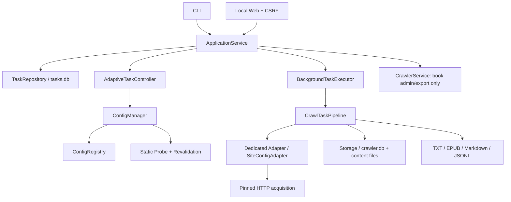
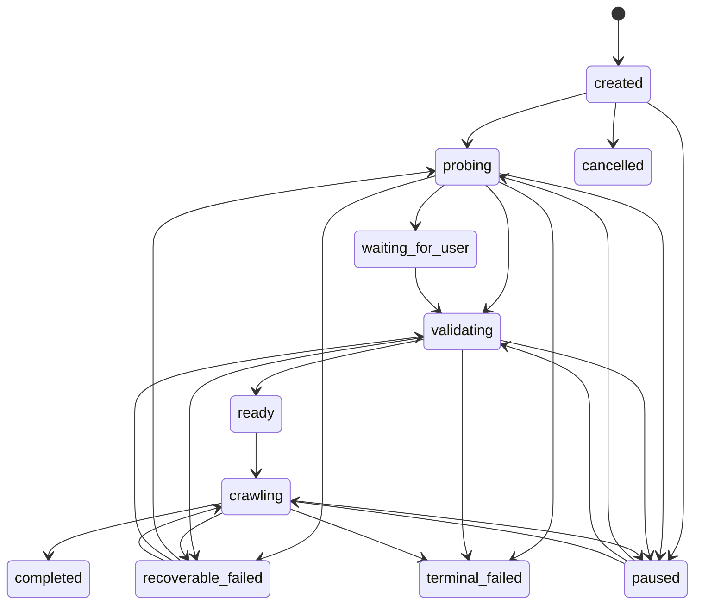

# 系统架构

Novel Crawler 0.2 以 `ApplicationService` 为唯一外部边界。CLI 和 Web 不能直接调用网络、任务数据库或旧同步抓取服务。生产获取只走静态 HTTP，不启动浏览器运行时。



## 入口与组合根

`novel_crawler.application.build_application()` 创建并连接：

1. 私有配置注册表
2. 固定 IP 的 HTTP 获取器和 URL 安全策略
3. 专项适配器路由、静态探测、重验证和配置管理器
4. `TaskRepository`、自适配控制器、生产抓取流水线和后台执行器
5. 书籍存储/导出所需的兼容 `CrawlerService`
6. 统一 `ApplicationService`

启动恢复在服务返回前执行。任一依赖创建失败时，已创建资源按执行器、控制器、任务库、书籍存储的顺序清理；失败不会回显内部 URL、路径或 token。

## 任务状态机



所有状态变化使用版本号 CAS，并写入只含稳定字段的事件。中断状态会保存 `resume_status`。旧版本遗留的 cleanup gate 仅用于兼容已有任务，新建静态 HTTP 任务不会创建浏览器清理 gate。

## 自动适配流程

1. **专项路由**：canonical domain 命中明确 `SiteAdapter` 时，使用经过站点测试的目录、章节和清洗规则。
2. **配置复用**：未命中专项适配器时，按 domain、URL pattern 和结构指纹查找已激活配置。
3. **重验证**：在有限静态样本上检查核心 selector、分页和结构漂移。
4. **通用探索**：抽取候选 selector，评分并进行目录、首章和相邻章一致性校验。
5. **停止或确认**：JavaScript/挑战信号直接返回不支持；仅配置置信度不足时转为 `waiting_for_user`。
6. **确认发布**：用户修正的配置重新静态验证后，写入不可变 registry revision 并更新安全 manifest。

适配决策见 [SITE_ADAPTATION.md](SITE_ADAPTATION.md)，配置详情见 [CONFIG.md](CONFIG.md)，注册表耐久性见 [REGISTRY.md](REGISTRY.md)。

## 抓取流水线

`CrawlTaskPipeline` 提供 `validating` 和 `crawling` handler。

### validating

- 加载并匹配已激活 `SiteConfig`
- 按 request policy 获取目录页
- 解析书籍和章节
- 应用 `start`、`count`、`max_chapters`
- 写入书籍/章节库存
- 将 `book_id`、`chapter_start`、`chapter_end`、`chapter_count` 和导出选项写入 `crawl-plan` checkpoint

### crawling

- 严格校验 crawl plan 的字段、类型、范围和库存总数
- 只遍历该任务持久化的章节范围
- 对每章申请带 owner、generation、token 和租约的 claim
- 以临时文件 + 原子替换写正文，再提交数据库 hash/状态
- 按批次更新 `chapter-progress` checkpoint
- 可恢复错误释放 claim 并保留恢复位置；不可恢复获取错误转为 `terminal_failed`
- 完成后按计划幂等导出

同一本书可以有多次不同范围的任务；历史章节不会扩大当前任务范围。

## 持久化

### tasks.db

- `tasks`：状态、版本、恢复状态/gate、受限 metadata
- `task_events`：追加式安全审计事件
- `task_checkpoints`：版本化、大小受限的 JSON checkpoint
- schema migration、WAL、busy timeout 和进程恢复

源 URL 以私有字段保存，安全 DTO 不返回它。错误消息只持久化稳定 code 或经过净化的受限文本。

### crawler.db 与文件

- `books`、`chapters`、日志和删除 job
- `(book_id, chapter_index)` 与 canonical URL 唯一约束
- 章节 attempt、claim generation、租约和 content hash
- 正文文件位于私有 `contents` 目录
- 导出文件位于私有 `output` 目录

数据库提交失败、claim 失效或内容冲突不会覆盖已有已确认正文。删除使用持久化 manifest/outbox，清理不完整时可重试。

## 网络信任边界

### HTTP

- 只允许 HTTP/HTTPS；拒绝 userinfo 和危险端口/地址
- DNS 结果全部检查，连接固定到已批准 IP
- TLS 仍使用原始 hostname 做 SNI 和证书校验
- 每次重定向重新执行安全策略和 IP pinning
- deadline、redirect、解压后响应体大小均有上限
- `PageSnapshot` 只保存脱敏 origin，不保存 path/query/fragment


生产代码不执行页面 JavaScript，不启动 Chromium/Playwright，不读取浏览器 profile 或 Cookie。遇到 JavaScript-only 内容、验证码、登录墙或挑战页时，获取流程停止并返回稳定错误码。

## Web 安全模型

- 默认只绑定 loopback
- 严格 Host 和 Origin
- HMAC 签名、`HttpOnly; SameSite=Strict` 的无状态会话
- 修改接口仅 JSON `POST`，需要 CSRF token
- 请求体、JSON 深度、连接数和读取时间有界
- handler 在关闭应用前排空；socket 错误只记稳定计数，不打印异常堆栈
- CSP nonce、`frame-ancestors 'none'`、`no-store` 和字段级 DTO 白名单

`--unsafe-remote` 只是显式风险开关，不提供登录认证或 TLS。

## 关闭顺序

```text
stop accepting Web requests
-> drain active handlers
-> stop/drain BackgroundTaskExecutor
-> close AdaptiveTaskController and HTTP acquisition
-> close TaskRepository
-> close crawler Storage
```

关闭可重试。任何上游未安全停止时，不会继续关闭其下游依赖。
